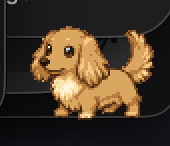
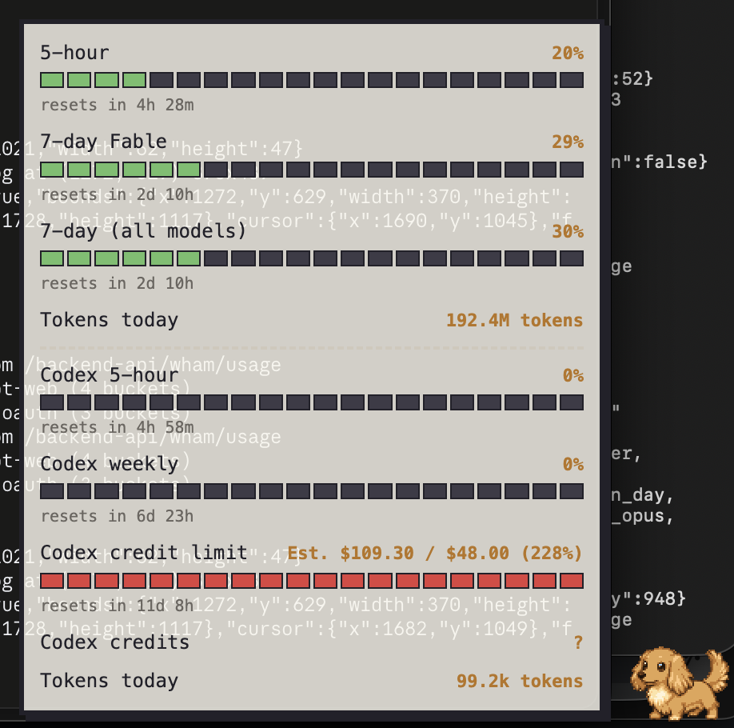

# Walder


Walder is a small pixel-art dog — a golden long-haired miniature dachshund — who
sits on your desktop and keeps an eye on how much of your AI subscriptions you
have left.

He has no window and no Dock icon. He sits in a corner of the screen, on top of
whatever you are doing, and gets on with four jobs:

- **His face tells you the number without you asking.** He is cheerful when your
  Claude 5-hour window is barely touched, and increasingly worn out as it fills.
- **He barks** — a little speech bubble — when you cross 80, 85, 90, 95 and 100 %.
- **He gets out of the way.** He curls up and sleeps tiny while you watch
  something fullscreen.
- **He can stay out of sight altogether.** Turn on **Hide when idle** and he is
  not on your screen at all until he has something to say — then he appears,
  says it, and leaves again a few seconds later.

Hover over him and a small card appears with the actual percentages. Click him
to pet him. Drag him anywhere. Right-click him for the menu. He also perks his
ears up when Claude Code finishes a reply, if you turn that part on.

macOS and Windows. Built with Electron.

## Get Walder

The latest macOS `.dmg` and Windows `.exe` are on the releases page:
**https://github.com/ViuMP/walder-releases/releases/latest**

On a Mac the first launch is blocked, because the app is not signed with an
Apple developer certificate — **Installing on a Mac** below is the way past it,
and it is a one-time thing.



Hover over him and the card appears — every window the two services report,
with the actual percentages and when each one resets:



## What you need

**macOS: Apple Silicon only.** There is no Intel build — the dmg is arm64, and
that is the only thing `electron-builder.yml` is asked to produce. On the OS
version: macOS 12 or newer is what Electron 44 supports, and the developers run
it on macOS 15. Nobody has tried it on anything in between, so that is a floor
from the runtime rather than a floor anyone has tested.

**Windows: 10 or 11, 64-bit.** Untested, as follows.

**A note on Windows before you start.** Walder is built and tested on a Mac.
The Windows installer is produced on that Mac, or by a GitHub Actions runner,
and **has never been run by the developers** — not the installer, not the tray icon, not the fullscreen
detection. It is expected to work; nobody has watched it. If you are the first,
please report what you actually see, including the parts that go fine.

## Installing on a Mac

1. Open the `.dmg` file.
2. Drag **Walder.app** into your **Applications** folder.
3. Open Applications and **double-click Walder**. macOS will block it — that is
   expected, and the next step is how you get past it. On macOS 15 and newer the
   block reads *"Apple could not verify 'Walder' is free of malware that may harm
   your Mac or compromise your privacy"*; on older versions it names an
   unidentified developer instead. Either way it is the same refusal.

   **Click "Done", not "Move to Trash".** Move to Trash is the highlighted button
   and it deletes the app you just installed. Done dismisses the block and leaves
   Walder in place for the next step.
4. Go to **System Settings ▸ Privacy & Security**, scroll down to the message
   about Walder being blocked, and click **Open Anyway**. Confirm, and enter your
   password or Touch ID if asked.

   **Open Anyway only appears after a blocked launch**, and it stops being
   offered about an hour later. If you do not see it, double-click Walder again
   to re-trigger the block and come straight back.

That is a one-time thing. After it, Walder opens like any other app.

**Why it is blocked.** Walder is not signed with an Apple developer certificate,
so macOS cannot check who made it and refuses to open it by default. **Open
Anyway** is how you tell macOS you trust it regardless.

*On macOS 14 and older*, right-clicking the app and choosing **Open**, then
**Open** again in the box, does the same job in one step. That shortcut was
removed in macOS 15 — right-click ▸ Open there gives you the same refusal as a
double-click — so **Open Anyway** in System Settings is the route that works on
every version.

### If macOS says Walder is **damaged**

If the message is *"Walder is damaged and can't be opened. You should move it to
the Trash"*, you have **0.2.2 or older**. **Open Anyway will not appear in System
Settings** — that dialog has no such button.

This is the one to tell apart from the ordinary block in step 3, and the wording
is what separates them: *damaged* is the broken case, while *"Apple could not
verify…"* or *unidentified developer* is the normal one that **Open Anyway**
clears. Both dialogs offer to move the app to the Trash, and in neither case is
that what you want.

It is not actually damaged, and the download is not corrupt: those
builds shipped a bundle whose code signature does not verify, and macOS reports a
quarantined app in that state as damaged rather than as untrusted.

**Fixed in 0.2.3.** If you can, install that instead and the four steps above are
the whole job.

To run an older build anyway, one command in Terminal removes the quarantine flag
the download added:

```bash
xattr -dr com.apple.quarantine /Applications/Walder.app
```

Then open Walder normally. One time only. **Only run this on software you
actually trust** — it is the same decision **Open Anyway** represents, taken a
different way.

## Installing on Windows

> **Not yet tested by the developers** — this section, and every other mention
> of Windows below, describes what the code is *built* to do; see
> [What you need](#what-you-need).

1. Run the `.exe`.
2. Windows SmartScreen will warn you that it does not recognise the app. Click
   **More info**, then **Run anyway**.
3. The installer asks where to put Walder and offers a desktop shortcut.

Same reason as on the Mac: the app is not signed with a certificate Windows
recognises, so Windows cannot tell who made it and warns you instead. One time
only.

## First run

There is no window, and nothing appears in the Dock or the taskbar. Two things
to look for:

- **A little bone icon** in the menu bar (Mac, top right) or the system tray
  (Windows, bottom right — untested, see the note above). That menu is the whole
  app — there is no settings window anywhere.
- **The dog**, in the bottom-right corner of your main screen.

Then set him up from that menu, in this order:

1. **Accounts ▸ Claude ▸ Log in…** — a normal login window opens on claude.ai.
   Log in as you would in a browser. The window closes itself once the login has
   taken.
2. **Accounts ▸ ChatGPT ▸ Log in…** — the same for chatgpt.com.
3. **Install Claude Code hooks…** and **Install Codex hooks…** — only if you use
   those tools, and only if you want the ears-up reaction. Each asks first,
   naming the file, then writes three small entries into that tool's config and
   tells you what it did. Your original file is copied first, and the matching
   **Remove …** item in the same menu undoes it. Codex needs one more step of its
   own — see [The Codex perk](#the-codex-perk). Walder offers both, once, the
   first time it starts on a machine that has the tool.
4. **Launch at login** — tick it so Walder comes back after a restart.

If you already use Claude Code or the Codex CLI on this machine, Walder can read
those logins on its own and may show numbers before you log in to anything.

The numbers refresh by themselves about every three minutes.

## His faces and his barks


His face follows **one** number: your **Claude 5-hour window**. That is the
allowance that actually runs out in the middle of an afternoon.

| Face | When |
| --- | --- |
| Happy — grinning, tail up | under 50 % used |
| Neutral — calm, breathing | 50 % to 79 % |
| Worried — ears down, a bead of sweat | 80 % to 94 % |
| Exhausted — half-closed eyes, panting | 95 % to 99 % |
| Out — flat on the floor, X eyes | 100 % or more |
| Confused — head cocked, a question mark | we could not read your usage |

**The confused face is honest, not broken.** It means Walder has no number for
your Claude 5-hour window right now: you are not logged in, a login has expired,
or the site answered with something it did not recognise. Hover over him — the
card names the problem — and **Accounts** in the menu is where you fix it. He
never shows a cheerful face on a number he does not have.

**Barking.** When a usage window crosses 80, 85, 90, 95 or 100 %, he barks once
with a bubble like `Claude 5h: 87% used`. Once per threshold per window, so he
does not nag. Every window he can see gets its own barks, not only the 5-hour
one.

**A bubble names the service; the hover card does not have to.** The card is a
table with a CLAUDE or CHATGPT heading over it, so its rows are `5-hour` and
`7-day (all models)`. A bubble is one line glanced at across the screen with no
heading and no neighbours, so it says `Claude 5h`, `Claude 7-day`,
`Fable weekly`, `Claude credits`, `Codex 5h`, `Codex weekly`, `Codex credits` —
the service first, and the word the card's layout was carrying dropped. If you
run Claude Code and Codex side by side, that is the difference between a warning
you can act on and one you have to go and look up. **The card's row labels are
unchanged.**

Every bark is the same shape — a name, a colon, a percentage — including the two
that are not thresholds: a Codex credit pool running dry and claude.ai refusing
further extra usage both read `…: 100% used`, because an empty pool and a hit cap
are 100 % by definition.

**Bubbles stay until you click him.** Every one of them — a bark, a `Claude
done`, a `Codex waiting`, the update notice. Nothing takes itself away on a timer. Walder polls every
three minutes and a bubble used to be up for twelve seconds of that, which meant
receiving a warning depended on happening to look at the corner of the screen at
the right moment; a warning you can miss by looking away is not a warning. The
one exception is the `…zzz` a pet earns from a sleeping dog, which fades on its
own because a click is what *makes* it.

Two things follow from that, and both are deliberate. A window that crosses a
*higher* threshold replaces its own bark in place — an 80 % bubble waiting to be
clicked becomes an 85 % one rather than letting 85 queue invisibly behind it. And
with **Hide when idle** on, an unclicked bubble is exactly what keeps him on
screen: he will not leave until you have dealt with it.

**What you can do to him:**

| Action | What happens |
| --- | --- |
| Hover | after a moment, a card appears beside him with every percentage, how long until each resets, where the numbers came from, and how old they are — at **Card size** Medium or Small it shows less of that, see below |
| Click | he squeezes his eyes shut and a heart pops up. Also dismisses whatever bubble is up |
| Drag | he follows the cursor. He will not let you push him fully off the screen |
| Right-click | the menu opens — the same one as the bone icon |

**What the card actually shows for Claude: your 5-hour window, your 7-day
window, a row per model your dashboard shows a separate weekly number for
(today that is **Fable**), and — only if your account has it switched on —
Extra usage. Nothing else Anthropic's response happens to contain.** The usage
endpoint hands back a great deal more, including internal, undocumented keys
that correspond to nothing on your dashboard, so the two halves of the response
are treated differently and on purpose:

- **The per-model rows come from the response's own list of them**, each
  carrying the display name claude.ai prints beside it. Those are shown
  whatever the model is called — if Anthropic adds a weekly row for a new model
  tomorrow, it appears on the card the same day, under the same name you read
  on the dashboard, with no Walder release needed.
- **A new *top-level* key is not picked up automatically.** Those arrive as
  bare identifiers with nothing to say whether they are an allowance at all,
  and Anthropic has shipped several that are not (`amber_ladder`,
  `nimbus_quill`, `seven_day_cowork`, `seven_day_omelette`,
  `seven_day_breakdown`). So a top-level key is shown only if Walder knows it
  by name; anything else is dropped and only shows up in the verbose log
  (Developer ▸ Verbose log) until a release adds it. That is deliberate rather
  than a gap: a keep-by-default rule is exactly what let `amber_ladder` sit on
  the card as a permanently-empty row until someone noticed it.

The **Fable** row is the dashboard's own per-model weekly row, read straight
from the response — Fable's own percentage, which is usually *not* the same as
7-day (all models). If your account reports no per-model row at all, Walder
falls back to showing the shared weekly pool again under that name, and the
card says "(shared pool)" so the two cannot be confused.

**Extra usage** is the money row: what you have spent this month, as
`$9.62 spent`. If you have set a monthly limit on claude.ai it becomes
`$9.62 / $50.00  (19%)` with a bar and the usual barks, because a spend
against a cap really is a percentage — and if you have not, there is no bar and
no percentage, because there is nothing to be close to. Either way Walder says
one thing if claude.ai reports that the limit has been reached, and says it
once. If you have not switched extra usage on, the row is simply absent —
never a `0%` one.

Its countdown reads **`resets in 19d 3h (est.)`**, and the `(est.)` is not
decoration. claude.ai's response states a monthly cap and a monthly spend and no
date whatsoever, so unlike every other row on the card this horizon is Walder's
arithmetic — the first of the next calendar month, UTC — rather than a figure
the provider gave him. If your billing anchor is your signup anniversary rather
than the calendar, this row will be a few days out and nothing else on the card
will be. That is exactly why it is the one line that admits where it came from.

**Tokens today** counts every token Claude Code and/or Codex has billed you
for today, since local midnight: input, cache writes, cache reads and output —
the same total the CLIs themselves report, not just what you typed. It comes
from the CLIs' own transcripts on your Mac (`~/.claude/projects` and
`~/.codex/sessions`), never from claude.ai or chatgpt.com — neither of those
endpoints reports a token count at all. No plan states a token allowance, so
there is nothing for the row to be a percentage of: no bar, and it never
barks. If a CLI is not installed, its row is simply absent — never `0 tokens`.

On the ChatGPT side, beside **Codex 5-hour** and **Codex weekly**, a **Codex
credits** row appears when your account has a credit pool *and the service says
something about it*: how many are left, `unlimited`, or that it has run out. It
has no bar, on purpose — the service says what is left but never what the pool
started at, and a bar would have to invent the missing half. When the service
only admits that a pool exists and will not say how much is in it (a common
answer), there is no row at all: a `?` under the credit limit row, which does
carry the number, was a line that said nothing. Walder says nothing about the
pool until it runs out, and then says it once.

**Codex credit limit** is the ChatGPT side's counterpart to Claude's Extra
usage: the monthly credit allowance your ChatGPT workspace sets for Codex. It
carries a bar (clamped full past 100%) and a reset line, because unlike Extra
usage this one does have a known billing anchor. Alongside the percentage —
`455%` on Victor's account, because the workspace can and does run past its
own limit — the row now shows a money figure the same way Extra usage does:
`Est. $109.30 / $24.00  (455%)`. That is 2,733 used against a 600 credit limit,
converted at a per-credit price, default `{ "amount": 0.04, "currency": "USD"
}` — OpenAI's own list price of $40 per 1,000 credits, hence the Est. prefix, since
OpenAI publishes no EUR price. To price it in EUR instead, hand-edit
`~/Library/Application Support/walder/walder.json` (no tray UI for this yet)
and relaunch:

```json
"codexCreditPrice": { "amount": 0.04, "currency": "EUR" }
```

Set it to `null` to drop the estimate and show plain credits instead:
`2,733 / 600 credits  (455%)`. An invalid value falls back to the default
price and leaves the rest of the settings file alone. If your account has no
spend limit set, the row is simply absent — never `0%`. This is a different
thing from the **Codex credits** row
above: that one is a *purchased* balance you buy down to zero, while the
credit limit is a workspace allowance measured as used-percent, and the two
can both be absent, both present, or either alone depending on how your
account is set up.

Clicks on the transparent space around him pass straight through to whatever is
behind, so he does not block anything he is not standing on.

## Sizes and colours

**Size** in the menu: **Small**, **Medium** or **Large** — one, two or three
screen pixels per drawn pixel. Walder is drawn on a 72 × 72 grid, so those are
**72 px**, **144 px** and **216 px** of screen.

**Medium is the default, and the size the artwork is drawn for.** 144 px is the
largest Walder was designed to be, and **Large deliberately goes past that**: it
is there for very high-resolution screens and for anyone who just wants a bigger
dog, but at 3x the individual pixels start to show and he takes up more of an
ordinary desktop than he was meant to. Small is the same drawing at one screen
pixel per drawn pixel — crisp, and easy to lose behind a window.

Asleep he is smaller still: the curled-up pose has its own 61 × 58 box, so the
sleeping dog is 61 px wide at Small and 122 px at Medium.

**Primary service** in the menu — **Claude** or **ChatGPT** — says which one you
actually live in. Its rows sit at the top of the hover card, and when several
windows cross a threshold in the same poll its bark is the one you see first;
the other waits for a click. It deliberately does **not** change the dog's face,
which always tracks the Claude 5-hour window — the face is the one thing on
screen at all times, and a setting that quietly re-pointed it would mean you
could no longer tell, from a worried dog alone, what he is worried about.

**Card size** in the menu — **Large**, **Medium** or **Small** — sizes the
*hover card*, and is a **separate setting from the dog's own Size**: a big dog
with a small card is a perfectly reasonable combination, and neither choice
moves the other.

| Card size | What is on it |
| --- | --- |
| **Large** (default) | everything: the WALDER header with how old the numbers are, a line per service saying which login answered, a status note when something is wrong, and per window a label, a percentage, a 20-segment bar and "resets in …" |
| **Medium** | the same numbers without the scaffolding: no header, no "via …" lines. Bars and resets stay. A status note appears only when something is actually wrong, and then it names the service — `Claude: login needed` |
| **Small** | one line per window, `7-day (all models)   63%`. No bars, no reset times, no header |

At Medium and Small a muted line appears at the bottom **only** when the numbers
are stale or have never been fetched — with no header, that is the only place
the age of the numbers can live, and Walder never shows numbers of unknown age
as though they were current.

**One thing Small leaves out on purpose:** the little `(shared pool)` note. The
"7-day Fable" row is the same weekly allowance as "7-day (all models)" under the
name you recognise, and on Large and Medium the note says so. On Small there is
no room, so two weekly rows can show the same percentage with nothing to explain
why — if that bothers you, use Medium.

**Show in overview** in the menu is a tick per row. Untick one and it is off the
hover card **at once** — the card redraws on the spot, not at the next poll —
and that row also **never barks** again. The two halves are the same setting: a
row that had gone quiet on the card and then announced itself anyway would be
the one exception nobody would think to look for. Tick it again and it comes
back where it was, without repeating the thresholds it already told you about.

**Untick every row a service has and the service disappears from the card** —
heading, "via …" line and all. It used to leave a CLAUDE heading over "no limits
reported", which is three lines to say nothing and one of them untrue: the login
is fine and the limits *were* reported, you just asked not to see them. A service
that genuinely reported no rows still says "no limits reported", because there
that line is the explanation rather than the noise.

Two things it deliberately does not do. It does not change the dog's **face**,
which goes on following the Claude 5-hour window whether or not that row is one
of the hidden ones — the same rule as Primary service, and for the same reason:
the face is the one thing on screen at all times. And it does not *lose* a pool
running out. If your Codex credits empty while that row is hidden, Walder notes
it quietly and stays quiet when you tick the row back on, rather than barking
`Codex credits: 100% used` about something that happened last Tuesday. Only the
pool refilling and emptying again is news.

The list holds every row Walder can name up front — Claude's above ChatGPT's —
**plus anything the last numbers carried that is not one of those**. The
services keep growing new rows (a per-model weekly window is the usual one), and
a row that can appear on the card has to be tickable, so an unrecognised one
shows up here under the name the card gave it.

**Colour** offers six coats: **Golden** (Walder himself), **Red**, **Cream**,
**Black and tan**, **Chocolate**, **Silver-dapple**. All three choices are
remembered.

## Fullscreen behaviour

When something goes fullscreen on the screen he is sitting on — a film, a video
call, a presentation, a game — he curls up into a tiny sleeping dog and stays
out of the way. (On Windows this leans on a small PowerShell helper that no
developer has ever watched run; if he never sleeps there, that is the first thing
to say in a report.) When it ends he stretches and stands back up. It is per screen:
a video on your second monitor does not put a dog sitting on the laptop screen
to sleep.

If a bark arrives while he is asleep, he wakes up long enough to say it. If you
click a sleeping dog he stirs and mumbles `…zzz` rather than waking.

To switch it off, untick **Sleep during fullscreen video** in the menu. He then
stays visible over everything.

## Hiding him until he has something to say

Tick **Hide when idle** in the menu and Walder is not on your screen at all
most of the time. He comes back for six things, and only these:

- a **bark** — you crossed 80, 85, 90, 95 or 100 % of a usage window;
- **Claude Code or Codex finished a reply** (`Claude done`, `Codex done`), if you
  installed that tool's hooks;
- **Claude Code or Codex is waiting for you** (`Claude waiting`, `Codex waiting`,
  and the `?` by his ear), likewise;
- your **Claude 5-hour window is used up** — the flat-out face, which has no
  bubble of its own;
- **Walder cannot read your usage any more** — the confused face, usually a
  login that has expired. He shows this once when it happens, not every few
  minutes;
- **a new version of Walder is out** — once per version.

Each time, he appears with a stretch, says his piece, and **stays for eight
seconds after the bubble goes away** before leaving again. Click him during
those eight seconds and they start over, so you can pet him or hover for the
full card without him disappearing mid-read.

While he is hidden there is nothing to hover over, so the menu shows the number
instead: **Claude 5-hour: 63% used**, right under his name at the top. That line
only appears while this mode is on.

Tick the item again — or press the shortcut — and he comes straight back.

**The keyboard shortcut.** The same thing as the checkbox, without opening the
menu:

- **Mac: ⌃⌘W** (Control-Command-W)
- **Windows: Alt+Shift+W**

The combination is shown next to **Hide when idle** in the menu, and
**Shortcut ▸** offers eight alternatives. Pick one there and it is remembered.

*On Windows, Alt+Shift is also Windows' own "switch keyboard language"
shortcut.* If you have more than one keyboard layout installed, choose
**Shift+F9** or **Ctrl+Shift+F12** from **Shortcut ▸** instead — both are free
on Windows and on the Mac.

If the menu says **⌃⌘W is already used by another app**, something else on your
machine got those keys first. Your choice is kept, so quitting that app makes it
work again; or pick a different one from **Shortcut ▸**. The checkbox always
works whatever the keys are doing.

## The Claude Code perk

If you use Claude Code in a terminal, Walder can react to it:

- **Claude Code finishes a reply** → his ears go up and he says `Claude done`.
- **Claude Code is waiting for you** (a permission question, or an idle prompt) →
  he tilts his head, shows a `?` by his ear and says `Claude waiting`, and holds
  it until you type your next message or click him.

The bubbles name the tool because Codex can say the same two things (below), and
"a reply is ready" is no use without "whose".

This needs **Install Claude Code hooks…** from the menu, once. It adds three
entries to `~/.claude/settings.json` that send a tiny message to Walder on your
own machine, and nothing else. If Walder is not running, the entries do nothing
and Claude Code carries on exactly as before.

That message goes to a listener which only accepts connections from your own
machine, normally on port 47811.

**The menu says whether it is working.** A line above the two items reads one of
four things, and there is a line like it for Codex:

- **Claude Code hooks: installed (port 47811)** — healthy. The number is there
  so it can go straight into a bug report.
- **Claude Code hooks: not installed** — the common case, and the item directly
  below it is the fix.
- **Claude Code hooks: installed for port 47811, Walder is on 47812** — the
  hooks are real but post to a door that closed. The listener walks to the next
  port when something else already holds the preferred one, and hooks written
  before that launch still point at the old number.
- **Claude Code hooks: Walder's listener is not running** — said first even when
  the hooks are also missing, because installing them now would only write a
  hook pointing at nothing. A restart is usually all it takes.

**And he tells you himself, once per launch.** If the hooks are missing at
startup he says `Install Claude Code hooks` (`Install Codex hooks` for the
other); if they are installed for the wrong port he says `Reinstall Claude Code
hooks` / `Reinstall Codex hooks`. Once, not once per check — nothing about
either state changes until you act on it, and the menu line above is where to
look afterwards. On a machine that has the tool but no hooks yet he also offers
to install them at the first launch, and takes "Cancel" for an answer
permanently: the tray items stay, the dialog does not come back.

## The Codex perk

The same for Codex, from **Install Codex hooks…** in the menu:

- **Codex finishes a turn** → ears up, `Codex done`.
- **Codex asks to run a command or apply a patch** → head tilt, `?`, `Codex
  waiting`, until you answer or click him.

It writes three entries into `~/.codex/hooks.json` — `Stop`,
`PermissionRequest` and `UserPromptSubmit` — carrying the same one-line `curl` as
the Claude hooks plus a header that tells Walder which tool is calling. A dated
copy of the file is saved beside it first. Codex merges every layer of its hook
config, so whatever is already in that file (or in `[hooks]` in `config.toml`)
keeps working.

**Your `config.toml` is not touched at all.** Its `notify` key belongs to the
Codex desktop app, which rewrites that file itself; Walder stays out of it.

**One extra step, and Codex does nothing without it.** Codex only runs a hook
whose exact definition you have trusted once, and it skips an untrusted one
silently: open a terminal, run `codex`, type `/hooks`, and trust Walder's three
entries. Until then Codex stays silent. Walder will not record that trust for
you — it is your review of a command that will run on your machine, and forging
it would make the whole step meaningless. The install dialog says this too.

**One gap, and it is Codex's:** there is no Codex hook for a plan-mode question,
only for approval prompts. A Codex session parked on a question that is not an
approval goes unremarked, and no amount of guessing here would fix it honestly.

## Troubleshooting

| Problem | What to do |
| --- | --- |
| You cannot find the dog, or he is on a monitor you have unplugged | Menu ▸ **Reset position** — he jumps back to the bottom-right of your main screen |
| Your clicks near the dog go to the wrong place | Menu ▸ tick **Force interactive (debug)**. His whole square then takes clicks. Untick it to go back |
| The card says **login needed** or **not logged in** | Menu ▸ **Accounts ▸ Log in…** for that service. Use **Log out** first if a login has gone stale |
| The card says **endpoint changed** | The service moved something we read. Nothing you can fix; the other numbers still work |
| Numbers look old, or nothing has updated | Menu ▸ **Refresh now**. It will not run more than once a minute — the item says how long to wait |
| The ears never go up when Claude Code finishes | The line above **Install Claude Code hooks…** in the menu says whether they are installed and for which port. Run the item again (the port can change if something else took 47811), then restart Claude Code |
| The ears never go up when Codex finishes, and the menu says the hooks *are* installed | You have not trusted them yet. Run `codex` in a terminal, type `/hooks`, and trust Walder's three entries — Codex skips an untrusted hook without saying so |
| He is asleep and there is no fullscreen video | Untick **Sleep during fullscreen video**, which wakes him immediately |
| The dog is gone, and nothing is fullscreen | **Hide when idle** is probably ticked — untick it (or press the shortcut) and he comes straight back. The menu's **Claude 5-hour** line at the top only appears while that mode is on, so it tells you at a glance |
| The hide shortcut does nothing | Open **Shortcut ▸**. If the line at the bottom says the keys are already used by another app, quit that app or pick a different combination — **Shift+F9** and **Ctrl+Shift+F12** are the safest. On Windows, Alt+Shift is also the keyboard-language switch |
| Something else is wrong | Menu ▸ **Developer ▸ Verbose log**, reproduce the problem, then **Report a bug…** (below) |

**The verbose log.** Ticking **Developer ▸ Verbose log** turns on a detailed log
file. Warnings are always written, whether or not it is ticked; the tick adds
the detail. It rotates at 1 MB and keeps three files, so it cannot fill a disk.

- Mac: `~/Library/Logs/walder/walder.log`
- Windows: `%APPDATA%\walder\logs\walder.log` (untested — the menu prints the
  real path, and that is the one to trust)

**Developer ▸ Reveal log file** opens the folder with the file selected, ready to
drag into a bug report. The full path is printed on the line underneath it, so
you can also read it off the screen instead of typing it out.

Logins and tokens are removed from anything written to that file.

## Reporting a bug

Menu ▸ **Report a bug…** opens a **draft** issue in your browser, on Walder's
public tracker, with the boring half already filled in. Three things are worth
knowing about it:

- **Nothing is sent until you press Submit on GitHub.** Walder has no server and
  does not post anything anywhere. The menu item opens a page; you read it, edit
  it, and send it — or close the tab, and nothing has happened.
- **You can see everything it says**, because it is in the page in front of you.
  The same block is also copied to your clipboard, so you can paste it if your
  browser loses it or you would rather file the report from another machine.
- **Please attach `walder.log`** — Menu ▸ **Developer ▸ Reveal log file** shows
  it in Finder, and you can drag it straight into the issue. If you can
  reproduce the problem, tick **Developer ▸ Verbose log** first, do it again, and
  send the file afterwards.

The report contains: Walder's version, your OS and its version, the processor
type, the Electron version, your screen sizes, your Walder settings (size, card
size, the two switches, which service is primary), what the last update check
found, whether Walder thought a fullscreen app was in front, and where the log
file is.

It does **not** contain your account, your email, any login or token, or any of
your usage numbers — there is no way for it to: the report can only carry the
fields listed above, and none of them is a percentage.

## Privacy

Walder reads three things, all on your own machine:

- Your existing **Claude** login — the Claude Code login if you have one,
  otherwise a claude.ai browser session you create through **Accounts**.
- Your existing **ChatGPT** login — a chatgpt.com browser session, or the Codex
  CLI login if you have one.
- **Claude Code and Codex hook events**, if you installed those hooks. They
  arrive over a listener that accepts connections only from your own machine.

Where it talks: `claude.ai` and `api.anthropic.com`, and `chatgpt.com`. The
login windows will only ever navigate to those sites, their sign-in pages, and
the "continue with Google / Microsoft / Apple" providers.

There is one more, and it is not about your account: **once every six hours,
`api.github.com`**, to ask which version of Walder is the newest. That request
carries nothing about you — no login, no account, no machine name, not even
which of the two services you use — only "which is the latest Walder". Untick
**Check for updates automatically** in the menu and Walder never asks of its own
accord again. The one exception is you: **Check for updates now** still asks,
because you clicked it.

Nowhere else.

One thing Walder does on your behalf, and only when he has to: when your Claude
Code login is about to lapse and he has no other way to read your usage, he
starts `claude` in the background, once, with an empty prompt — so that Claude
Code renews its own login, the way it does every time you open it. No
conversation, no transcript, nothing saved. Walder never reads or sends your
refresh token, and he never does this more than once per expiry.

Logins and tokens are read at the moment a check is made and held in memory
only. They are never written to the settings file, never written to the log
(anything that looks like one is masked), and never sent anywhere except back to
the service they belong to. The settings file keeps your position per display,
his size, the card size, his colour, which service is primary, how often Walder
polls, the hook port it prefers and the one it actually got, launch at login,
sleep during fullscreen, hide when idle and its shortcut, whether the automatic
update check is on, the last version you were told about, the Codex credit
price, which rows you have hidden, the once-only flags for the first-run
introduction and the two hook offers, the last percentages (never a login), and
the request paths — path only, never a query string — that Walder watched go by
while you logged in, which it replays only to that same site.

No analytics. No telemetry. No account, no server of ours, nothing phoning home.

**Log out** under **Accounts** clears that service's whole stored session, not
only its cookies.

## Updating

**Walder tells you when there is a new version.** He checks about every six
hours, and when there is one:

- the menu's bottom item reads **Update available: 0.1.3 — Download…**, which
  opens the download page in your browser;
- and the dog says it once — a small `Walder 0.1.3 is out` bubble. Once per version,
  not once per check.

You can also ask at any time: **Check for updates now**, at the bottom of the
menu. It will not run more often than once a minute, and the item says so.

**A manual check always answers.** If there is nothing newer, the dog says
`You're up to date` — a bubble like any other, which goes when you click him.
You pressed something, so something has to happen; a button that produces no
visible result reads as a broken one. The automatic six-hourly checks stay
**silent** when there is nothing to report: those are Walder's idea rather than
yours, and a bubble four times a day saying nothing has changed is nagging.

**Nothing installs itself.** Walder does not download anything and never
replaces itself — it only tells you and opens the page. You install the new
version the same way as the first one: quit Walder from the menu, then drag the
new **Walder.app** into Applications (Mac), or run the new installer (Windows).

**Why not automatic?** Walder is not signed with an Apple developer
certificate, so *every* new copy has to be let through by hand in **System
Settings ▸ Privacy & Security ▸ Open Anyway**. An app that quietly replaced
itself would leave you with a Walder macOS refuses to open and no explanation.

Your settings, position, size, colour and logins are kept — they live outside
the app itself.

If you would rather not be told, untick **Check for updates automatically** at
the bottom of the menu. Walder then makes no request of its own — and
**Check for updates now** is still there for the day you want to know.

## Uninstalling

**If you installed the hooks, take them out first:** menu ▸ **Remove Claude Code
hooks…** and **Remove Codex hooks…**. Each asks first, naming the file it is
about to change, then strips Walder's three entries and leaves everything else in
that file untouched. A dated copy is saved beside it either way.

If for some reason that fails, you can do it by hand. Open the file in a text
editor and delete the entries whose `command` line contains `walder-hook`:

- `~/.claude/settings.json` — one each under `Stop`, `Notification` and
  `UserPromptSubmit`.
- `~/.codex/hooks.json` — one each under `Stop`, `PermissionRequest` and
  `UserPromptSubmit`. Nothing of Walder's is ever in `~/.codex/config.toml`.

There is also a dated copy of each file from before Walder first touched it,
named `settings.json.walder-backup-…` / `hooks.json.walder-backup-…`, in the same
folder.

Then:

- **Mac:** **Quit** from the menu, then drag **Walder.app** to the Trash.
- **Windows** (untested, like everything else on Windows): quit from the tray
  menu, then uninstall through **Settings ▸ Apps** (or Add/Remove Programs) as
  usual.

Your settings file is left behind and does no harm. If you want it gone too:
`~/Library/Application Support/walder/` on a Mac, `%APPDATA%\walder\` on
Windows.

## Accessibility

**Still mode**, in the menu, stops every animation: no breathing, no tail, no
stretch. He holds a resting frame and stays there. His *face* still changes with
the number, because a different picture is not motion — a worried dog is still
worth seeing. If your system's Reduce Motion setting is on, Still mode switches
itself on with it.

For screen readers he carries a spoken label, rebuilt whenever anything changes:
*"Walder, worried. Claude 5-hour 87% used."* A bark is announced when it
appears, and each row of the hover card reads as one sentence rather than a
scatter of cells.

**What nobody has checked:** whether VoiceOver actually reaches him at all. He
is a click-through window that never takes focus, which is an unusual thing to
point a screen reader at, and no one here has tried it. If you use one, please
report what you hear — including nothing.

## For developers

Node.js 22.12 or newer (24 recommended). `npm install` also downloads the
Electron runtime (~130 MB, first time only). Every push runs
`npm run typecheck && npm test` on GitHub Actions, and builds an unsigned
installer for each platform as a downloadable artifact
(`.github/workflows/ci.yml`).

| Script | What it does |
| --- | --- |
| `npm run dev` | Run the app in development, with hot reload |
| `npm run build` | Compile main, preload and renderer into `out/` |
| `npm run sprites` | Open the animation gallery: every animation of the loaded sheet at 4x with its name, frame count and frame durations, a palette switcher, a "play once" button for the one-shots, and a 1-px grid toggle. This is how the artwork gets approved |
| `npm run probe` | Ask every usage provider once, from the terminal, and print what each said |
| `npm run probe -- --keys` | Same, but prints only the key names of each usage payload, never the numbers — the fastest way to check what a provider's response actually contains before deciding whether a new key is a real window or noise |
| `npm test` / `npm run test:watch` | Run the unit tests |
| `npm run typecheck` | Type-check everything without emitting |
| `npm run dist:mac` / `dist:win` / `dist:all` | Build installers into `release/` |
| `npm run release` | Publish the installers in `release/` **and `docs/HANDBOOK.html`** (shown on the release page as `Walder-<version>-HANDBOOK.html`) to the public releases repo (`ViuMP/walder-releases`) with `gh`, which is where the app's update check looks. The handbook is required: a missing one stops the run and tells you to rebuild it with `python3 docs/handbook/build_walder.py`. Needs `gh auth login` once. `-- --dry-run` prints the command without publishing; `-- --clobber` replaces the files on an existing release |
| `npm run install-hooks` | Install the Claude Code hooks (`-- --remove` takes them out, `-- --codex` does the same for `~/.codex/hooks.json`) |
| `npm run sync:sheet` | Copy `art/walder.json` into the app after validating it (runs automatically before `dev`, `build` and `sprites`; a sheet that fails validation stops the build instead of reaching the app) |
| `npm run gen:tray` | Regenerate the tray icons (runs automatically before `dev` and `build`) |
| `npm run gen:icons` | Regenerate the app icons from the sprite (runs automatically before `dist:*`) |
| `npm run check:asar` | Open the packaged `app.asar` and check what went into it: no source, tests, artwork or config; every runtime dependency present; no native build tooling. Runs automatically after `dist:mac` and `dist:win` |

`WALDER_LOG=1 npm run dev` turns on the diagnostics; add `WALDER_DEBUG=1` to
outline the clickable area in magenta.

```
src/core/       Pure TypeScript: no Electron, no network, fully unit-tested.
                buckets.ts / usage.ts    provider payloads -> the snapshot
                card-layout.ts           what the hover card says, per card size
                expression.ts            usage % -> which face to show
                nudge.ts                 when to bark, once per threshold
                behaviour.ts             arbitrates usage, hooks, clicks, fullscreen,
                                         and whether he is on screen at all
                bubble.ts                speech-bubble wording and wrapping
                shortcuts.ts             the vetted hide-shortcut presets and their labels
                semver.ts                version comparison for the update check
                update-check.ts          the update schedule, parsing and menu wording
                fullscreen.ts            is the active window fullscreen, per display
                hittest.ts / interaction.ts / geometry.ts   clicks, drag, clamping
src/main/       Electron main process: windows, tray, timers, poller, hook
                server, login windows, settings store.
src/providers/  The four usage sources and the chain that orders them.
src/preload/    The contextBridge seam between main and renderer.
src/renderer/   The overlay window, the hover panel, the sprite gallery.
src/sprites/    The sprite sheet the app draws (a validated copy of art/).
art/            The artwork and its generator. See art/README.md.
test/           Vitest suites, provider fixtures, the old M3 checklist.
docs/           BUILD_LOG.md (the stage-by-stage record), QA-CHECKLIST.md.
```

Anything under `src/core/` must stay free of Electron imports so it can be
tested in plain Node — that is what keeps the tricky logic (threshold firing,
window resets, tolerant payload parsing) provable. `docs/QA-CHECKLIST.md` is the
manual checklist, and it includes an honest list of what no human has ever
verified.

## Licence

The code is MIT — see [`LICENSE`](LICENSE). Take it, change it, ship it.

**The dog is not.** Walder is Victor's own illustration and all rights are
reserved on it: the artwork, and the sprite sheet that is the artwork stored as
data, are covered by [`art/LICENSE`](art/LICENSE) instead. So you are welcome to
fork the code — a fork ships its own mascot.
